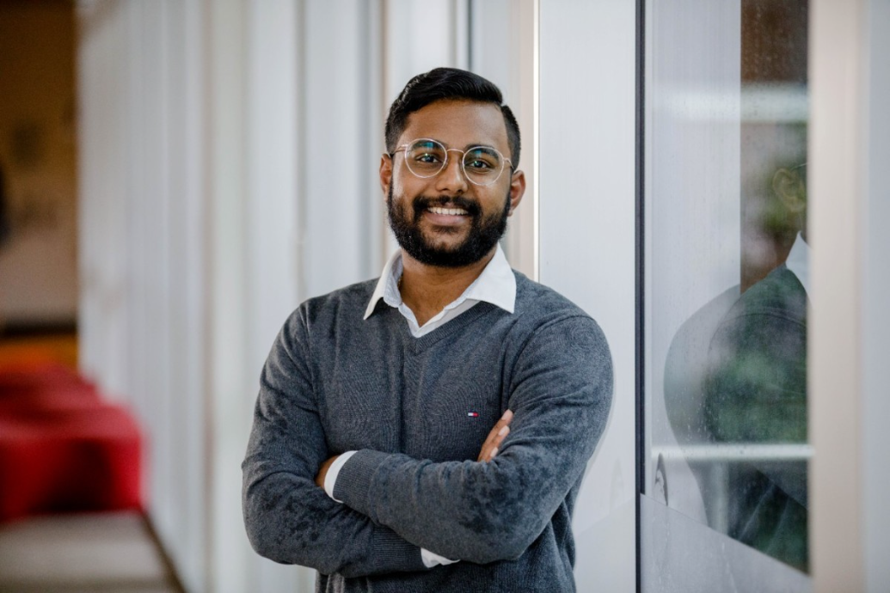

## Hey! Welcome to my Blog!

I am a 6th Year Student at The University of Queensland studying Bachelor of Engineering and Bachelor of Computer Science. I am currently taking ELEC4630 as an Elective expanding my knowledge and interest areas in the field of Image Processing and Comptuer Vision. Thourgh this blog I hope to recount of my journey into Assignment 3 and document my learning on FastAI. So, Welcome to my Blog! 

## Recent Posts

